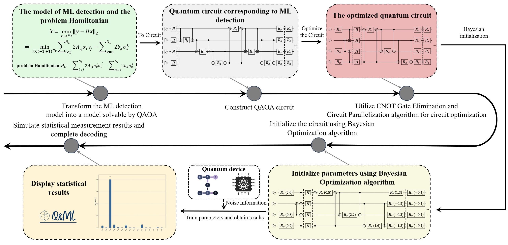

<h2>
A PyThon Library for Quantum Computation and Machine Learning
</h2>
<h3>
Updated, Scalable, Easy Implement, Easy Reading and Comprehension
</h3>

    
    
    
   
       
    

 

## Quantum & Machine Learning
Relevant scripts and data for the paper entitled "Low-depth Quantum Approximate Optimization Algorithm for Maximum Likelihood Detection in Massive MIMO"

## Table of contents
* [**Main work**](#Main-work)
* [**Our contributions**](#Our-contributions)
* [**Results display**](#Results-display)
* [**Python scripts**](#Python-scripts)
* [**Dependencies**](#Dependencies)

## Main work
In massive multiple-input and multiple-output (MIMO) systems, the problem of maximum likelihood (ML) detection, reformed into a combinatorial optimization problem, is NP-hard and becomes increasingly complex with more transmitting antennas and symbols. The quantum approximate optimization algorithm (QAOA), recognized as a prime candidate for execution on noisy intermediate-scale quantum (NISQ) devices, has demonstrated a quantum advantage in approximately solving combinatorial optimization problems. Hence, in this paper, a **comprehensive QAOA based ML detection scheme** is proposed for binary symbols. In the proposed framework, recognizing that solving small-scale problems with the sparse channel matrice only requires the use of a 1-level QAOA, we first derive a more universal and concise analytical expression of the expectation value of the 1-level QAOA, compared to the state-of-the-art schemes. This advancement aids in the analysis of solutions for small-scale problems. Subsequently, for large-scale problems that require more than 1-level QAOA, we introduce the CNOT Gate Elimination and Circuit Parallelization algorithm. This significantly reduces the number of error-prone CNOT gates and circuit depth, thereby diminishing the adverse effects of noise. Additionally, we propose a Bayesian Optimization based Parameters Initialization algorithm, which assists in obtaining initial parameters for large-scale QAOA from small-scale and classical instances, thereby increasing the likelihood of identifying the precise solution. Finally, in numerical experiments, we evaluated the bit error rate (BER) performance of our improved QAOA based ML detector both with and without noise, demonstrating its resistance to noise. Impressively, at an SNR of 15 and in the absence of noise, the performance improved by $6.7 \times$, while in noisy conditions, the improvement was $7.8 \times$. Further, by analyzing the convergence curves of the loss function, the proposed scheme also showed significant advantages in both parameter convergence and the minimum convergence value.

**Figure 1.** The specific workflow of the improved QAOA based ML detection.

## Our contributions
* We provide a **comprehensive scheme** for QAOA based ML detection, encompassing the transformation of the ML detection model, the construction and optimization of QAOA circuits, the training of circuit parameters, and numerical simulations incorporating real noise. This comprehensive scheme enables the decoding of received signals, laying the foundation for the practical use of QAOA in ML detection.
* We derive a more **compact and universal analytical expression** for the cost function of the $1$-level QAOA, aiding in the analysis of solutions for small-scale problems with sparse channel matrices.
* We propose an optimization algorithm for QAOA circuits used in ML detection problems, namely the **CNOT Gate Elimination and Circuit Parallelization algorithm**. This algorithm significantly reduces the number of error-prone CNOT gates and the circuit depth in QAOA, thus mitigating the noise impact during circuit execution.
* We introduce a parameter initialization scheme based on the **Bayesian Optimization algorithm**, which learns high-quality initial parameters by optimizing a set of small-scale and classically simulable problem instances. Our initialization scheme accelerates the convergence of the cost function to lower minimum value and enhances resistance to circuit noise, greatly improving the probability of finding the optimal solution.
* We provide a series of **numerical simulation** results to demonstrate the advantages and value of our proposed scheme.

## Results display

**Figure 2.** The decoding results obtained by $N_{t} = 4$, $p = 1, 2, 3, 4$ QAOA circuits.

**Figure 3.** Comparing the BER of different schemes with $N_{t} = 6$.

**Figure 4.** Comparing results and convergence speed of Random parameter initialization and Bayesian parameter initialization under circuit noise.

## Python scripts
Here is the **brief introduction** to each Python file for better understanding and usage:

* "main.py" primarily includes the generation of **transmission signals**, addition of **AWGN noise**, **SNR**, and **channel matrixk**.
* "circuit_noise.py" mainly involves the addition of noise from **real quantum devices** during quantum circuit simulation, including gate errors, T1 and T2 relaxation errors, and readout errors.
* "circuit_optimization.py" primarily involves optimizing QAOA quantum circuits using the **CNOT Gate Elimination and Circuit Parallelization algorithm**, significantly reducing the number of CNOT gates and the depth of the circuit.
* "parameter_optimization.py" primarily involves **the initialization and training of parameters** in QAOA circuits.

## Dependencies
- 3.9 >= Python >= 3.7 (Python 3.10 may have the `concurrent` package issue for Qiskit)
- Qiskit >= 0.36.1
- Qiskit-aer >= 0.12.0
- The calculation may require the large amount of RAM
